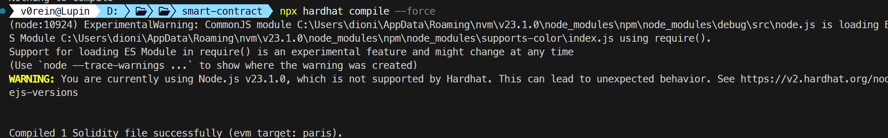
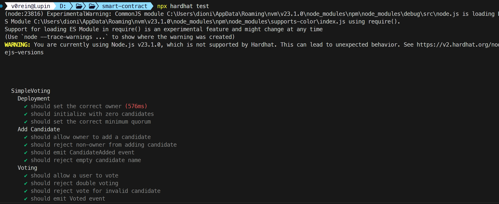
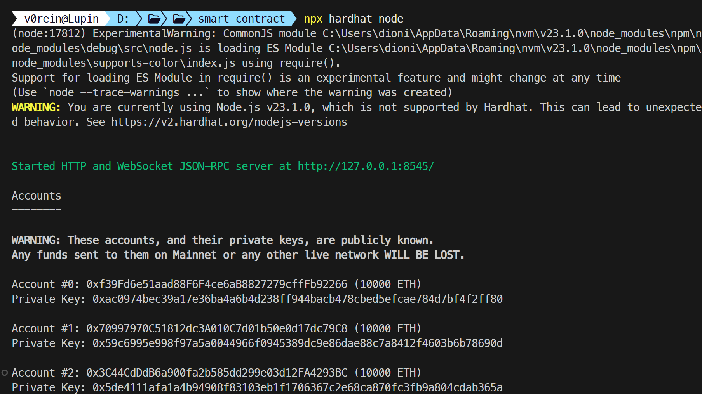
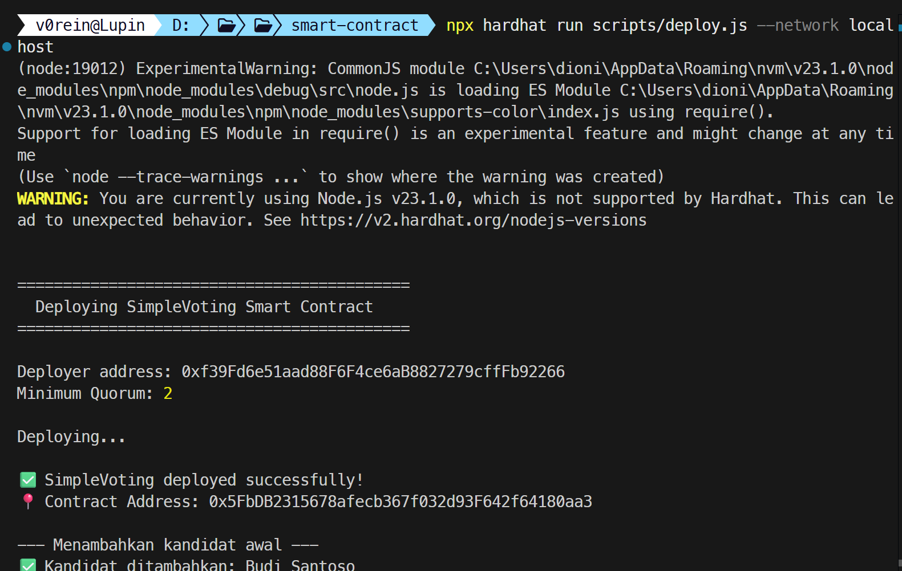
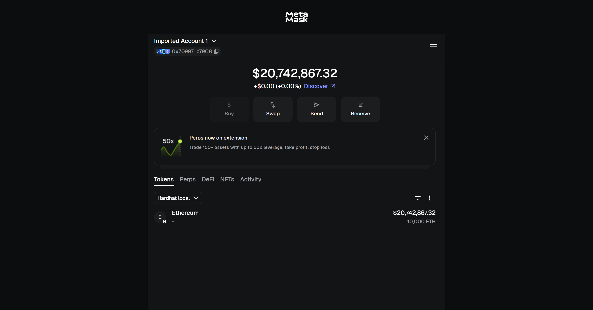
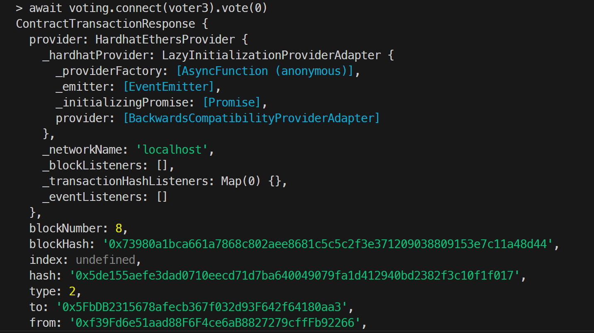
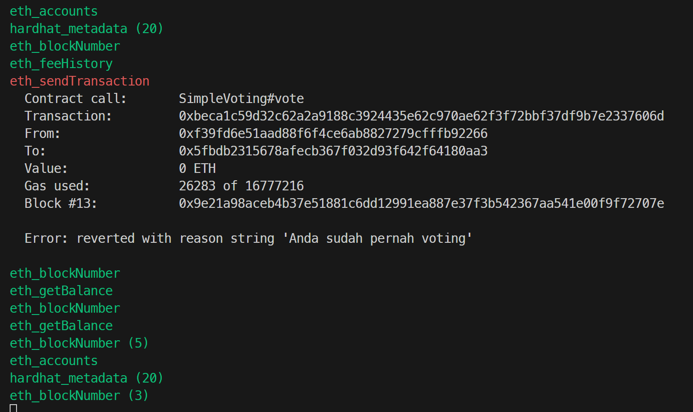

# Simple Voting - Smart Contract

## Deskripsi

Sistem voting sederhana berbasis blockchain yang memungkinkan pemilihan (ketua kelas, proposal, dll). Smart contract ini di-deploy ke local blockchain menggunakan Hardhat dan dapat diinteraksikan menggunakan MetaMask.

## Anggota Kelompok

- Dionisius Marcell Putra Indranto (5027231044)

## Fitur

### Fitur Wajib ✅

- **Tambah Kandidat**: Owner (admin) bisa menambahkan kandidat baru
- **Voting**: User bisa melakukan vote untuk kandidat pilihan (sekali per user)
- **Hasil Voting**: Menampilkan hasil voting dan menentukan pemenang
- **Event Logging**: Setiap aksi penting tercatat sebagai event di blockchain

### Fitur Bonus 🌟

- **Deadline Voting**: Owner bisa mengatur batas waktu voting
- **Minimum Quorum**: Hasil voting hanya valid jika jumlah voter mencapai minimal tertentu

## Tech Stack

- **Solidity** `^0.8.20` - Bahasa pemrograman smart contract
- **Hardhat** - Development environment
- **Ethers.js** - Library untuk interaksi dengan blockchain
- **Chai** - Testing framework

## Cara Menjalankan

### Prerequisites

- Node.js v18+
- npm atau pnpm

### Installation

```bash
npm install
```

### Compile

```bash
npx hardhat compile
```

### Test

```bash
npx hardhat test
```

### Deploy (Local)

```bash

npx hardhat node

# Terminal 2: Deploy contract
npx hardhat run scripts/deploy.js --network localhost
```

### Interact

```bash

npx hardhat run scripts/interact.js --network localhost
```

## Smart Contract Details

### State Variables

| Variable         | Type                       | Deskripsi                           |
| ---------------- | -------------------------- | ----------------------------------- |
| `owner`          | `address`                  | Pemilik contract                    |
| `votingDeadline` | `uint256`                  | Batas waktu voting (UNIX timestamp) |
| `minimumQuorum`  | `uint256`                  | Jumlah minimum voter                |
| `totalVoters`    | `uint256`                  | Total voter yang sudah vote         |
| `candidates`     | `Candidate[]`              | Array kandidat                      |
| `hasVoted`       | `mapping(address => bool)` | Tracking voter                      |

### Functions

| Function               | Akses     | Deskripsi              |
| ---------------------- | --------- | ---------------------- |
| `addCandidate(name)`   | onlyOwner | Menambah kandidat baru |
| `vote(candidateId)`    | public    | Melakukan voting       |
| `setDeadline(minutes)` | onlyOwner | Set deadline voting    |
| `getCandidateCount()`  | view      | Jumlah kandidat        |
| `getCandidate(id)`     | view      | Detail kandidat        |
| `getWinner()`          | view      | Pemenang voting        |

### Events

- `CandidateAdded(uint256 candidateId, string name)`
- `Voted(address voter, uint256 candidateId)`
- `DeadlineSet(uint256 deadline)`

## Contract Address

> _Diisi setelah deploy_

## Screenshot

> 
>
> 1. Compile berhasil (`npx hardhat compile`)
>
> 
>
> 2. Test passing (`npx hardhat test`)
>
> 
>
> 
>
> 3. Deploy berhasil (output contract address)
>
> 
>
> 4. MetaMask connected (Network Hardhat Local)
>
>  > 
>
> 5. Transaksi berhasil (minimal 2 transaksi berbeda)
>
> 
>
> 6. State berubah (bukti perubahan data di contract)
